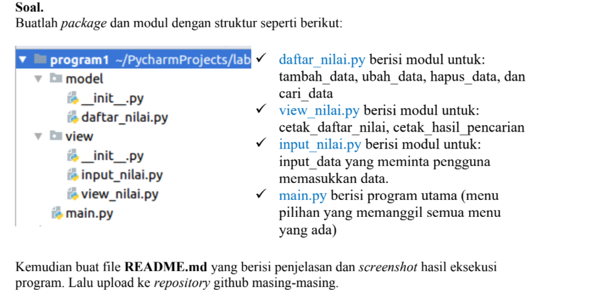

# UAS SEMESTER 1

## **NAMA : DINDA AMALIA**
## **NIM  : 312110571**
## **KELAS: TI.21.C5**

Pada UAS di pertemuan ke-16 ini, saya diberikan beberapa tugas oleh dosen saya, yaitu diantaranya:



Dan ini adalah hasil package yang sudah saya buat


## SOAL 1 (Daftar_Nilai)

Pada soal pertama, dibawah ini saya telah menyantumkan beberapa syntax yang nantinya akan menghasilkan semua modul dari package Daftar_Nilai yang diantaranya adalah (Tambah Data, Ubah Data, Hapus Data, Dan Cari Data)

```py
from View.input_nilai import *
data={}
class daftarnilai():
    def tambah_data(self):
        tambah_nama = nama()
        tambah_nim = nim()
        tambah_tugas = tugas()
        tambah_uts = uts()
        tambah_uas = uas()
        tambah_akhir = akhir()
        data[tambah_nama]= tambah_nim,tambah_tugas,tambah_uts,tambah_uas,tambah_akhir
        print('Data berhasil ditambahkan !!!')

    def ubah_data(self):
        ubah_nama = nama()
        if ubah_nama in data.keys():
            tambah_nim = nim()
            tambah_tugas = tugas()
            tambah_uts = uts()
            tambah_uas = uas()
            tambah_akhir = akhir()
            data[ubah_nama]= tambah_nim,tambah_tugas,tambah_uts,tambah_uas,tambah_akhir
            print('Data berhasil diubah !!!')
        else:
            print('data tidak ditemukan !!!')            
    def hapus_data(self):
        hapus_nama = nama()
        if hapus_nama in  data.keys():
            del data[hapus_nama]
            print('data berhasil dihapus')
        else:
            print('data tidsk ditemukan !!!')


    def keluar(self):
        print('TERIMAKASIH')
```
Jadi kesimpulannya jika kalian menggunakan semua syntax yang saya tunjukan diawal dan memasukan '1' pada kolom yang tersedia dan kalian run, maka akan mendapat output seperti dibawah ini, yang dimana itu adalah hasil untuk menambahkan data.


Kedua untuk menghasilkan modul Ubah Data kamu perlu memasukan '2' dan menghasilkan output sebagai berikut :


Ketiga untuk menghasilkan modul Hapus Data kamu perlu memasukan '4' dan menghasilkan output sebagai berikut :


Untuk mencari data itu sendiri kalian hanya perlu memasukan inisial dari modul tersebut. Misalkan kalian ingin mencari moodul untuk Menghapus Data, maka kamu hanya perlu memasukan angka '4' pada kolom yang tersedia.

## SOAL 2 (View_Nilai)

Untuk menjawab soal nomer 2, kalian hanya perlu mengetikan huruf "5" pada kolom yang di sediakan untuk melihat hasil pencarian ataupun daftar nilai. Maka nanti akan mendapatkan hasil output seperti gambar dibawah ini.


## SOAL 3 (Input_Nilai)

Pada soal ke-3 ini, jika kalian ingin menginput suatu data yaitu sama halnya seperti kalian memasukan huruf "1" untuk menambahkan suatu data. Dan hasil output yang dihasilkan pun sama yaitu sebagai berikut.


# **TERIMAKASIH**